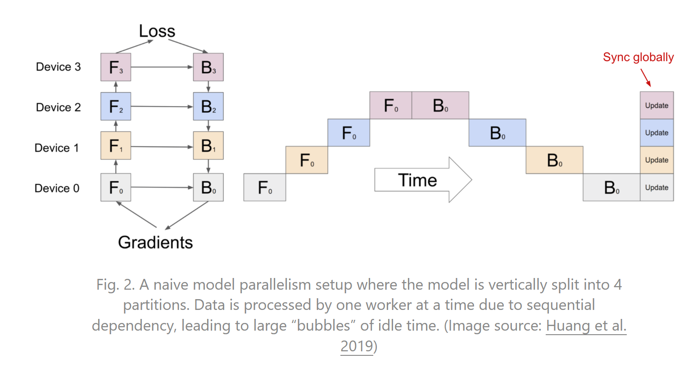
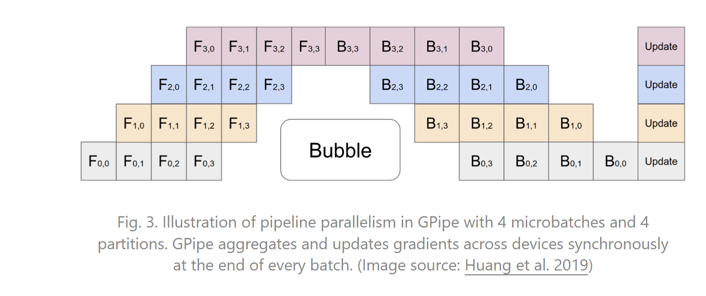

参考翁丽莲的这篇博客 https://lilianweng.github.io/posts/2021-09-25-train-large/

## 大模型训练？

- 大模型训练的最主要瓶颈是显存不够，一张卡放不下。显存的来源有权重值、中间激活值以及优化器状态。
- 并行可以加速

## 数据并行（DP）

数据并行在每张卡上都存储相同的模型有着相同的权重，在每个minibatch的最后，计算完loss后，每张卡同步梯度或权重。有两种同步方式：

- Bulk synchronous parallels (BSP):每张卡在每个minibatch的最后同步数据，这个时候所有卡都必须等待同步结束。
- Asynchronous parallel (ASP): 每张卡异步的更新数据，不需要等待或暂停。这个时候有可能会获取到过时的权重。这种方式虽然会加快处理数据的速度，但不一定会减少收敛的速度。

## 模型并行（MP）

模型并行可以解决单卡放不下完整模型权重的情况。对模型进行切分，放到不同的卡上去执行。按layer切分模型的话，会有很多bubble，计算资源浪费的很严重。

如图，模型并行存在的问题：

- 单卡放的下这个模型的情况下，那么模型并行不会减少总的训练时间，反而浪费了大量的计算资源
- 其实GPU之间没啥并行

## 流水线并行（PP)

将数据并行和模型并行组合在一起，来减少bubbles。主要思路就是首先把模型按照layer分成多个stage模型并行，把每个minibatch再拆分为mirobatch做数据并行，每个worker同时处理一个microbatch。

### Gpipe

#### 计算过程的一些细节

前向过程中，每张卡的4个微批量计算时使用的是用一个权重。

#### 怎么切模型？

bubble的大小和GPU的个数是相关的（其实就是切分了多少个partition），有多少个GPU就长什么样子，所以微批量切的越多的话，bubble的占比就越小，GPU利用率就会越高。数据之间是没有关联的，通过切分微批量来提高并行度。

需要保证切分的每个区的计算量大小差不多：

- 让用户指定
- 实际跑一边，就知道计算量了

#### 批量归一化 

如果网络中有batchnorm需要做特殊处理。batchnorm原本是对一个批量中所有的数据算均值和方差，现在切分为m个微批量，需要特殊处理。layernorm不会有这个问题

#### 降低显存

Gpipe只会存partition边界处的激活值，算梯度的时候重算中间的激活值，用时间换空间，节省显存。

#### 通信开销

这部分相对比较低，因为卡之间不需要发送整个权重，只需要发送最后一层的结果。

