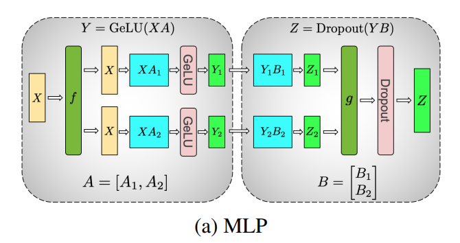
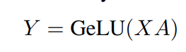
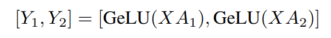
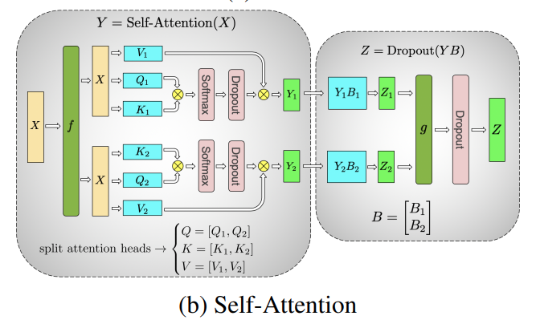

# Megatron-LM: Training Multi-Billion Parameter Language Models Using Model Parallelism

Megatron针对特别大的transformer模型设计，这篇文章主要是在讲怎么切分Tensor。

## MLP

MLP的第一个矩阵乘：

X在每个GPU上都有一份，把A按列拆分为A1, A2，这样：

在第一个GeLU的时候就不需要Reduce。B则按照行切分，最终在Dropout之前使用一次AllReduce算子聚合。

## Self Attention

每个head放在不同的GPU上，B按行切分为B1,B2，各自算完后在Dropout之前Allreduce聚合。

## 嵌入层

 