# Reducing Activation Recomputation in Large Transformer Models

https://arxiv.org/pdf/2205.05198.pdf

这篇论文来自MLSys 2023，英伟达Megatron-LM团队，实际2022年早些时候就已经放在arxiv上了。主要目标是减少流水线并行中每个microbatch的中间激活值的内存。

## Introduction

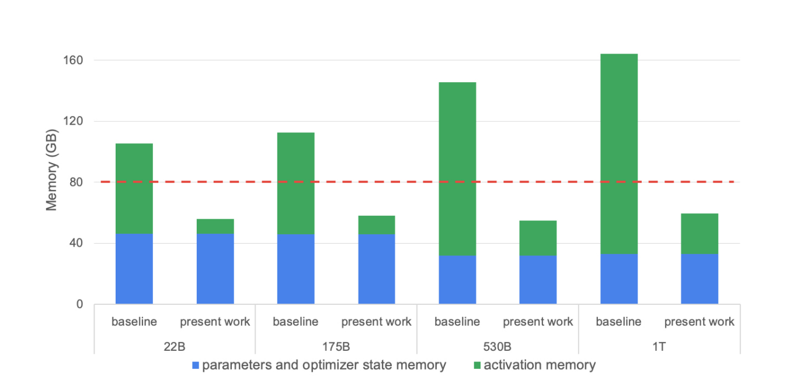

如图，A100的显存是80G，显然是放不下的。

之前的做法一般是只保留切分的partition边缘的激活值，其余的全部丢弃，在反向传播的时候重新计算这些激活值，作者团队在他们的训练中测得这样做有额外的30%-40%开销。这篇论文提出一种新的方法，节省内存，并且 have no, or very low, impact on compute efficiency。
## Transformer Architecture

变量名如下：

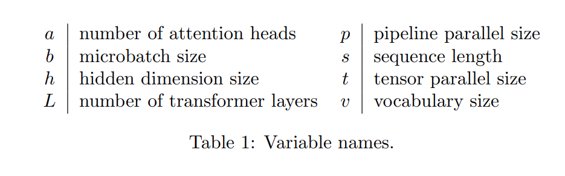

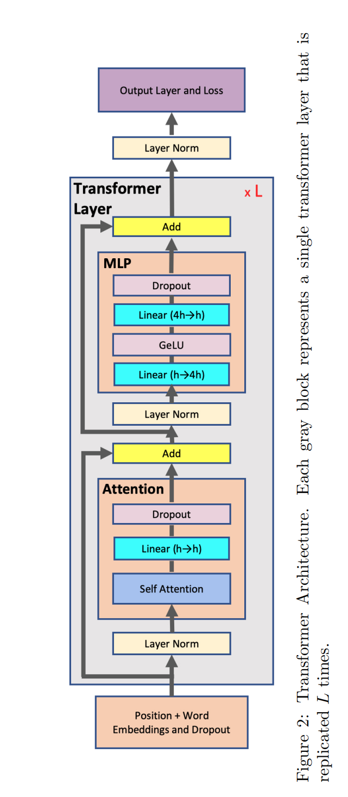

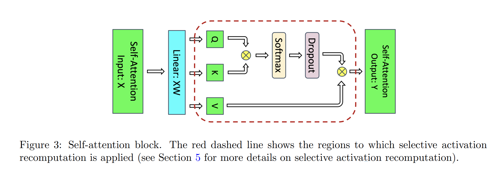

### Model Parallelism

#### 张量并行

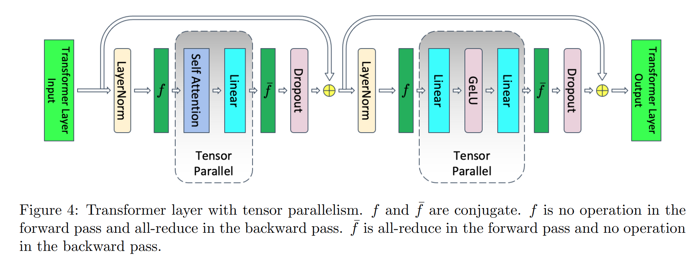

Megatron第一篇论文中提到的张量并行，假设有t路的张量并行，那么图中虚线部分的激活值显存也会被划分为t份，所以此时每个layer的显存占用为：

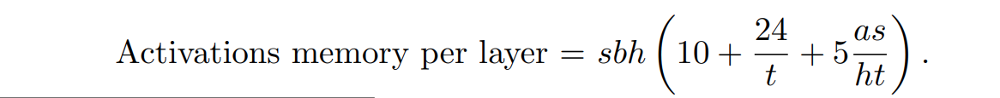

#### Sequence Parallelism

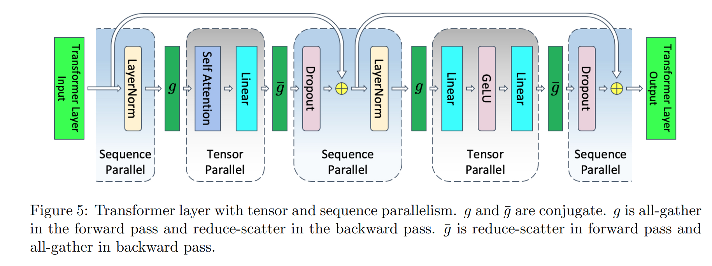

Layernorm和Dropout算子在sequence维度上的操作是独立的，所以可以在sequence维度上对tensor进行切分，所以引入额外的通信算子。在原来的f算子之前要额外的做一次all-gather。

通信算子g：

- 前向为all-gather
- 反向为reduce-scatter

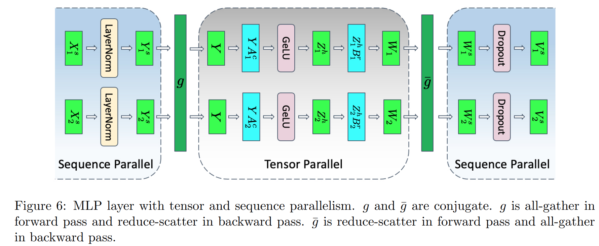

通信成本比较：

- 原本的张量并行需要四个all-reduce算子（前向和反向）
- 加入Sequence Parallelism后，需要四个all-gather和四个reduce-scatter算子。

**但是，ring-allreduce算法中，allreduce本来就由reduce-scatter和all-gather组成，所以通信开销并没有变大。**

除此之外，第一个线性层的输入Y作为激活值在反向的时候也可以拆分，而不需要存储完整的Y。在计算反向的过程中，同时使用all-gather算子去计算完整的Y，这样可以隐藏计算开销。

使用Sequence Parallelism后，每层的激活值显存为：

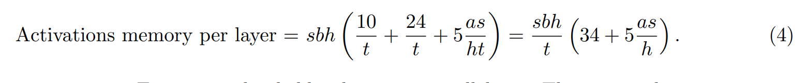

#### 流水线并行

对于有L个Layers的transformer，流水线大小为p，那么第一个stage需要的显存为：

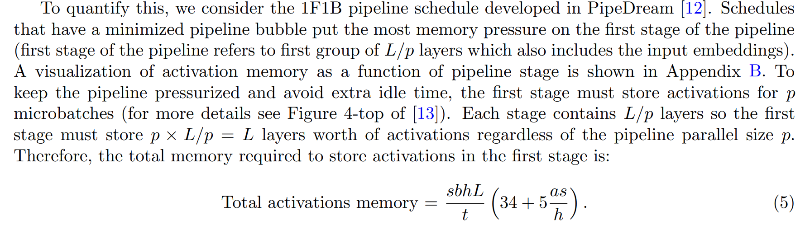

##  （关键）Selective Activation Recomputation

论文给的数据完全丢弃激活值的话，在重计算的时候会引入30%~40%的计算开销，所以在显存和计算之间，怎么选择，怎么平衡是个问题。

**很简单的想法，就是丢弃计算量大但是占用显存多的算子的激活值，Softmax、Dropout。** 这些算子有着比较大的输入，所以激活值占用的显存比较大，但是浮点数的计算量又比较小。这部分丢掉就去掉了一半以上的显存了。

量化这部分的数据，原文如下：

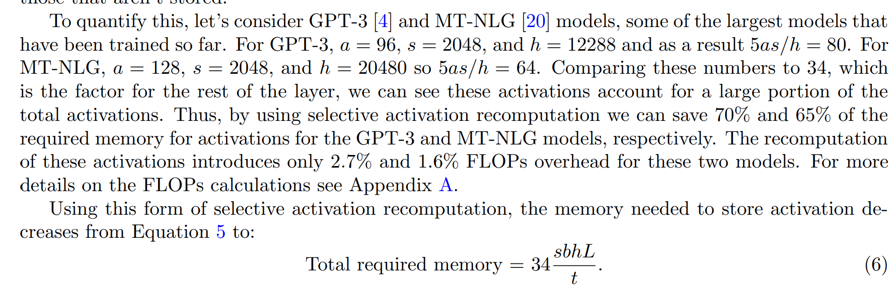

省了非常多的显存，但只增了一点点的计算。

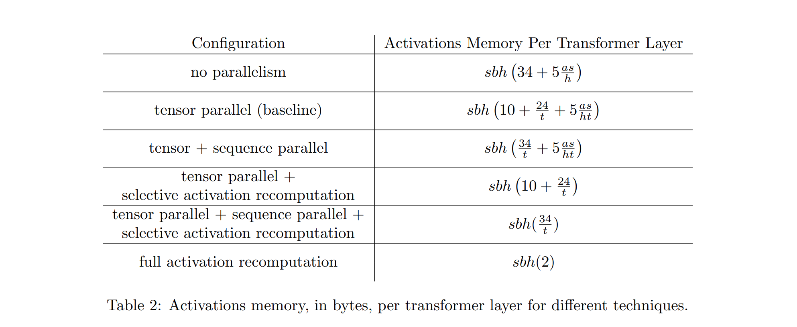
