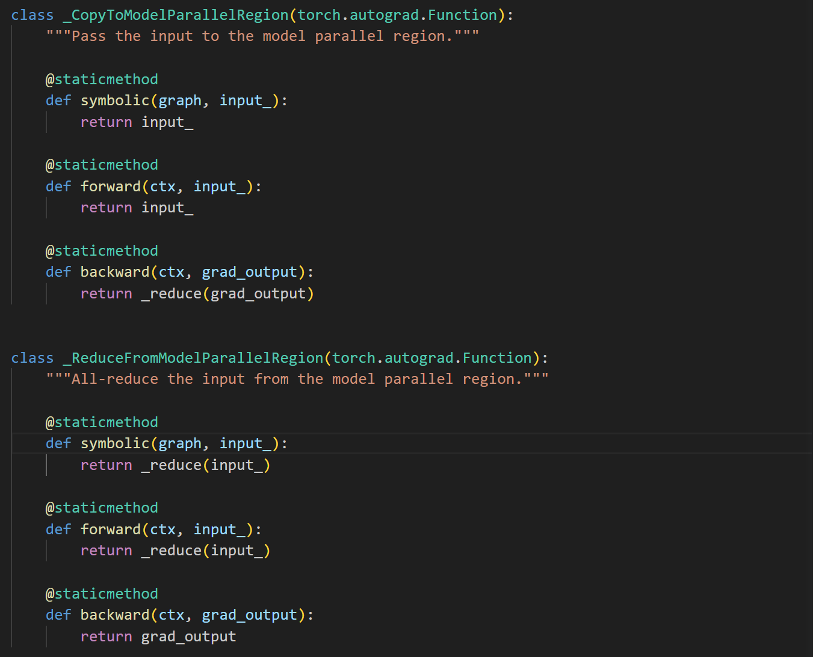

# 张量并行源码

代码路径 `NVIDIA/Megatron-LM/megatron/core/tensor_parallel`

## 分布式集合通信

相关分布式通信算子在`mappings.py`文件中。

### 通信原语

通信原语使用的是` torch.distributed`中的通信算子，例如AllReduce算子：

```python
def _reduce(input_):
    """All-reduce the input tensor across model parallel group."""

    # Bypass the function if we are using only 1 GPU.
    if get_tensor_model_parallel_world_size()==1:
        return input_

    # All-reduce.
    torch.distributed.all_reduce(input_, group=get_tensor_model_parallel_group())

    return input_
```

使用`torch.distributed`中的`all_reduce`,`all-gather`,`all_gather_base`,`_reduce_scatter_base`实现了`_reduce`, `_split_along_last_dim`, `_split_along_first_dim`, `_gather_along_last_dim`, `_gather_along_first_dim`, `_reduce_scatter_along_first_dim`函数。

### 通信算子



Megatron-1论文中的f算子，这两个算子共轭，前向和后向过程相反，分别为identity和reduce。
